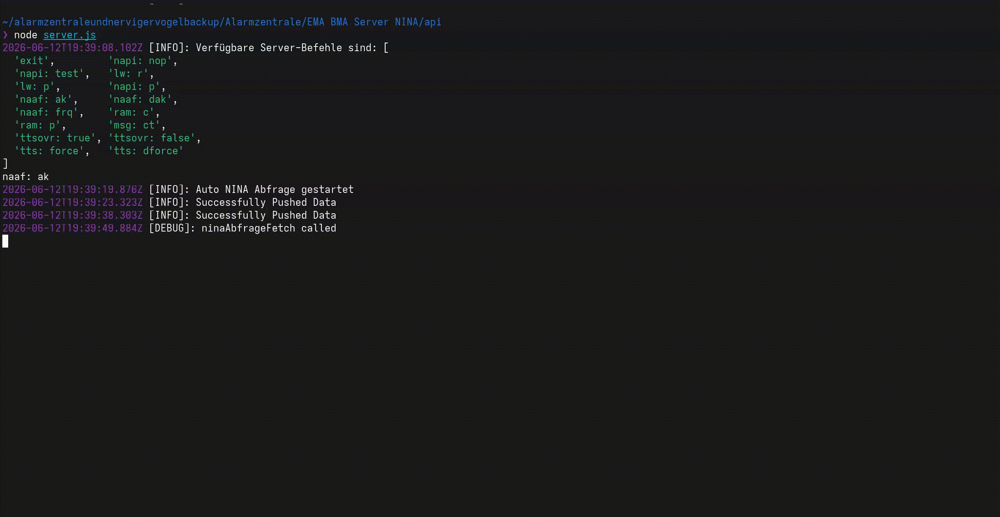
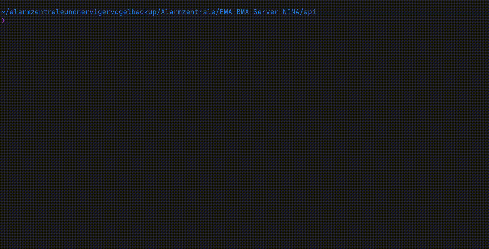
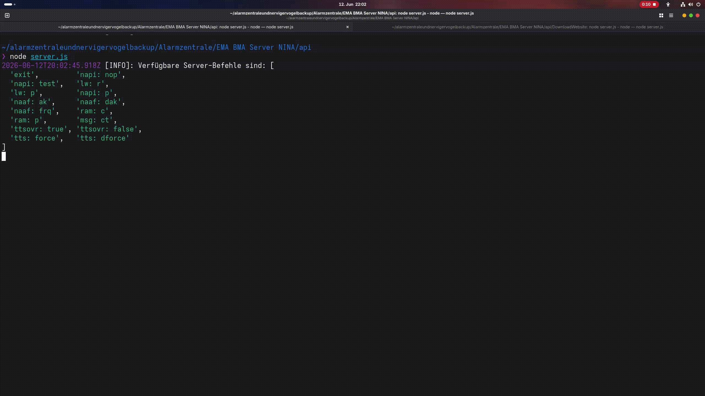
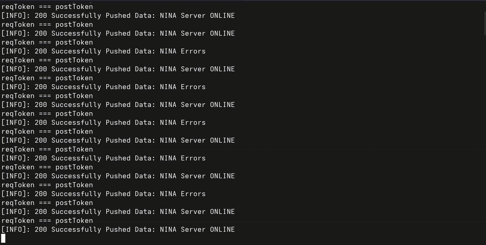

# nina-tts-alert
A Node.js server that fetches official alert messages from the BBK (Bundesamt für 
Bevölkerungsschutz und Katastrophenhilfe) via the NINA API, converts them to speech, 
and saves the output as output.mp3. The generated audio can be played through an 
intercom or speaker system to broadcast warnings via downloading the file from the Express server.
Due to this project featuring the BBK, all console output (including commands and errors) 
and therefore warnings are currently **in German**. Support for warnings, commands, and 
errors **in English is not planned but may come in the future**.

## Tech
- `Coqui TTS`
- `Node.js`
- `FFmpeg`
- `Express.js`
- `bcryptjs`

## Features
- Real-time warnings (output: audio; German TTS voice — interval check or manual fetch request)
- Configurable fetch request for warnings (for areas defined by the official ARS code; configurable via console commands)
- Console log & commands
- Sorting by warning severity
- Warning schematic
- API for downloading warnings with minimal front-end configuration

## Running the Project

- Install Node.js
- Install Python 3.10.13
- Install FFmpeg
- Install venv
- Create a virtual environment (with venv)
- Install TTS
- Open the console (in ~/server)
- Run `node server.js`
- Open the console (in ~/server/DownloadWebsite)
- Run `node server.js`

→ The program should now be running.

> Note: Everything should be installed in the **same directory** (~/server).
> Please configure the Programm before starting, see "Configuration".
> Every node module that is used should also be installed.

## Console Commands

### For ~/server/server.js
- `exit`: Exits the program, so you don't have to close and re-open the console
- `napi: nop`: Switches the NINA API to the normal NINA API
- `napi: test`: Switches the NINA API to the test API
- `lw: r`: Resets the variable letzeWarnung (i.e. **resets the last warning**)
- `lw: p`: Prints the variable letzeWarnung (i.e. **prints the last warning**)
- `napi: p`: Prints which NINA API is currently in use
- `naaf: ak`: Activates the automatic fetch request for the NINA API (i.e. **activates the real-time warning system**)
- `naaf: dak`: Deactivates the automatic fetch request for the NINA API (i.e. **deactivates the real-time warning system**)
- `naaf: frq`: Starts a manual fetch request for the NINA API
- `ram: c`: Clears the RAM of the program
- `ram: p`: Prints the RAM usage of the program
- `msg: ct`: Tests the coloring of messages (i.e. tests whether errors are displayed in red, etc.)
- `ttsovr: true`: Manually activates the TTS Override
- `ttsovr: false`: Manually deactivates the TTS Override
- `tts: force`: Activates TTS Force
- `tts: dforce`: Deactivates TTS Force

### For ~/server/DownloadWebsite/server.js
- `exit`: Exits the program, so you don't have to close and re-open the console

## Meanings of Unclear Terms

### Gong
The gong is an attention sound that plays before the warning is read by the TTS system.
This gong is included in the repository.
- `gong_moderat.mp3`: Plays if the severity of the warning is moderate
- `gong_schwer_extreme.mp3`: Plays if the severity of the warning is severe or extreme
- `warnungunterbrochen.wav`: Plays if TTS Override is active

> Note: Inspired by C.A.S.S.I.E., a facility AI from a video game.

### RAM
The RAM of the program stores up to 9 warnings to prevent the TTS system from looping. 
This would occur if 2 warnings were present and the filtering system only checked against 
the last warning.

**Example with 2 warnings:**

TTS system outputs the first warning → program checks for another warning that isn't the 
last warning → TTS system outputs the second warning → program checks for another warning 
that isn't the last warning → TTS system outputs the first warning → **LOOP**

> Note: The RAM cache is temporary and will be cleared when the program exits
> (via the `exit` command or by closing the console). Previously processed warnings
> may be read out again after a restart (if they are still active).

### Normal and Test API
The *normal* API checks for warnings in the area selected by the ARS code. This API 
should not be changed once set up (it is the API that checks for warnings in, for example, 
your area. It should only be changed if you move to a different location.)

The *test* API also checks for warnings in an area selected by the ARS code. This API 
should be pointed to a location where a known warning has been issued, in order to test 
whether the system works correctly. (Check the NINA app to find a city with an active 
warning, then update the ARS code of the test API. Switch APIs using the console commands 
while the program is running, then perform a manual fetch request.)

> Note: See "Meanings of Unclear Terms" -> "ARS" for more information about ARS.
> See "Configuration" -> "Change of the API" for more information about configuring the ARS code for the API.

### Naaf
The naaf (NINA Automatische Abfrage, i.e. NINA Automatic Fetch System) activates or
deactivates the *real-time warning system*. Once enabled, it checks every 60 seconds for
a warning from the selected API (see console commands on how to enable, disable, or
change the API).

The naaf can also perform a one-time fetch request (`naaf: frq` — see Console Commands
for more details).

> Note: The server must be running 24/7 for the real-time warning system to work.

### TTS Override
The TTS Override activates automatically when a new warning with a higher severity than 
the current one has been issued for the area. It can also be activated manually 
(see Console Commands → `ttsovr`).

### TTS Cooldown
After a warning has been processed, the TTS system will not process any other warnings 
for 5 minutes. This cooldown can only be bypassed by the TTS Override or by TTS Force.

### TTS Force
The TTS Force skips all checks in the `playTTSQueue` function. **Use with caution!**
This will bypass:
- Loop prevention
- Previously processed warning checks
- The TTS-already-running check

### ARS
[The Official Municipal Code (AGS), formerly also known as the Official Municipal 
Identification Number (GKZ), Municipal Identification Number, or Municipal Code Number, 
is a numerical sequence used to identify politically independent cities, municipalities, 
or unincorporated areas in Germany.](https://de.wikipedia.org/wiki/Amtlicher_Gemeindeschl%C3%BCssel#Regionalschl%C3%BCssel)
This system is used by the BBK (as stated on the website: [nina.api.bund.dev](https://nina.api.bund.dev/)). 
You can find the ARS code for your city [here](https://www.xrepository.de/api/xrepository/urn:de:bund:destatis:bevoelkerungsstatistik:schluessel:rs_2021-07-31/download/Regionalschl_ssel_2021-07-31.json).

## How It All Works
The program checks for warnings in the selected area, either via a manual fetch request 
or automatically via the naaf if activated (see "Meanings of Unclear Terms" → "Naaf").

Once a warning has been fetched for the area (i.e. the BBK has issued a warning for the 
selected area), the program fetches the description and inserts it into the standard 
warning schematic. After the full text has been generated, the TTS program converts the 
text into a .wav file.

FFmpeg then merges this .wav file with the appropriate announcement gong. The final audio 
file is saved as output.mp3 in `~/server/DownloadWebsite/Warnungen`.
To download the file either go to `localhost:`[Insert here the port the Express server is using]`/server/nina/audio/Warnungen` and get from the
JSON response `downloadPath: /server/nina/audio/Warnungen/Download` or go directly to `localhost:`[Insert here the port the Express server is using]`/server/nina/audio/Warnungen/Download`.

## Configuration

### Configuration in ~/server/server.js

#### Change of the API
If the ARS code is for the normal API, copy & paste it into the variable `ARSkeintest` 
in `~/server/server.js` (e.g. with WebStorm). If the ARS code is for the test API, copy & paste 
it into the variable `ARStest` in `~/server/server.js` (e.g. with WebStorm).

After saving, the ARS code should have updated for the selected API. You can verify this 
by switching to that API (while the program is running) using `napi` (see: Meanings of 
Unclear Terms → Normal and Test API | Console Commands → `napi`).

> Note: The last 7 digits of the ARS code must be replaced with "0"

#### Change of the URLs
If your Express server is using a different port than `3000`, change the variable `port` to the port that your Express server is using.

### Configuration in ~/server/warnungstts.js

#### ttsBin
The variable `ttsBin` must be changed, so that the text can be converted into speech.
It contains the path of the installation of `Coqui TTS`. 
The variable should be changed to something like this:
`/home/yourname/.pyenv/shims/tts`

> Note: The variable has to be directly the path to `tts` which is `Coqui TTS`.

### Change of the Tokens
This program uses `bcryptjs` for tokens, so that only the program itself can push data to the Express server.
To create the tokens, run `~/server/DownloadWebsite/tokenCreate.js`. Before you run it, make sure you change the variable tokenInput to your password.
Insert the password for each variable (`hash`,`hash2`, `hash3`) in `~/server/server.js`. Then insert each encrypted password (the generated token from `tokenCreate.js`) in the array `tokens`.

> Note: The first encrypted password in the array `tokens` is for pushing errors of the NINA server (`~/server/server.js`).
> The second encrypted password in the array `tokens` is for pushing if the NINA server (`~/server/server.js`) is online.
> The third encrypted password in the array `tokens` is for pushing data of the warning that the NINA server (`~/server/server.js`) handled.

### Important Notes on Configuration
As of now (2026-06-12, format: YYYY-MM-DD), the program does not have many configuration 
options (e.g. for English warnings).

## API Links of the Express server

- `localhost:`[Insert here the port the Express server is using]`/server/nina/audio/Warnungen`: Get Request; answer: You will get information if a new warning has been issued.
  Format:
  `{
  neueWarnung:[Boolean],
  datum:[Date],
  schweregrad:[Integer from 1 to 4],
  downloadPath:[API Link for downloading the output.mp3 file]
  }`
  
- `localhost:`[Insert here the port the Express server is using]`/server/nina/audio/Warnungen/Download`: Download link for output.mp3
- `http://localhost:`[Insert here the port the Express server is using]`/server/nina/status/push`: Link to push errors, used in `~/server/server.js`
- `http://localhost:`[Insert here the port the Express server is using]`/server/nina/status/online/push`: Link to push data if the NINA server is online (`~/server/server.js`), used in `~/server/server.js`
- `http://localhost:`[Insert here the port the Express server is using]`/server/nina/tts/push`: Link to push the current active warning, used in `~/server/server.js`
- `http://localhost:`[Insert here the port the Express server is using]`/server/status`: Get Request; answer: You will get all information about the server (e.g. errors, if the NINA system is online etc.)
  Format:
  `{
    nina: {
      active: [Boolean],
      speaking: [Boolean],
      severity: [String],
      title: [String],
      message: [String],
      sent: [Date],
      audioDownloadPath: "/server/nina/audio/Warnungen/Download",
    },
    errors: [Array],
  }`
  
> Note: The `schweregrad` is an integer from 1 to 4, 1 being the lowest severity (`Minor`) and 4 the highest severity (`Extreme`).

## Using it with an Intercom system
To use this program for an intercom system you will first need to host the program on a local machine (e.g. hosting it with a `Raspberry Pi 4 8GB`) and configure the firewall
to allow requests from the local network. The second step is to build an "intercom node", this contains a loudspeaker, `esp32` and everything else you need for playing an audio file through a loudspeaker.
As of the third step, you will have to program the `esp32` so that it will automatically fetch `localhost:`[Insert here the port the Express server is using]`/server/nina/audio/Warnungen`. If `neueWarnung = true` and `datum` is not the last logged date, make the esp32 use `localhost:`[Insert here the port the Express server is using]`/server/nina/audio/Warnungen/Download` to download the output.mp3 file. In the last step, program the esp32 to automatically play this file. That's it. Everything else is handled server side.

## Legal Notice
This project is intended for **private, non-commercial use only** (e.g. home intercom systems).
The author is not responsible for any misuse of this software.
By using this project, you agree to comply with all applicable local laws and regulations.
This project is not affiliated with, endorsed by, or connected to the BBK or any government agency.

